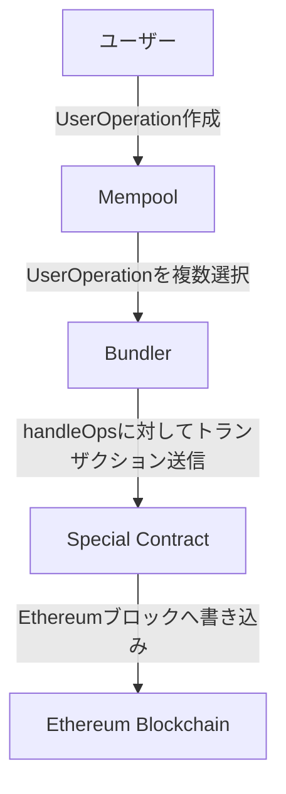

## [ERC-4337](https://eips.ethereum.org/EIPS/eip-4337)を読む

[MynaWallet Contracts](https://github.com/MynaWallet/contracts)のコードを読んでいく中で、ERC-4337について理解していないと適切なIssue, PRを出せないと感じたので、原本を読んでいく。

各章を読んだことでわかったこと、実装の前提で押さえておくべきことを記載していく。

EIPの章立ては基本的に以下の通りらしい。

- Abstract: 提案の目的・概要
- Motivation: 提案で解決できる問題・必要性
- Specification: 具体的な実装・関数・変数、改変される仕様
- Rationale: 設計意図
- Backwards Compatibility: 既存のEthereumプロトコルやスマートコントラクトとの互換性
- Reference Implementation: 実装の詳細や参考例
- Security Considerations: サイバー攻撃ベクトルやセキュリティリスク要因
- Copyright: 著作権

### Abstract

割愛。

### Motivation

[EIP-2938](https://eips.ethereum.org/EIPS/eip-2938)と同様に、Ethereumにおけるトランザクションの処理をより柔軟にするウォレットの実現が目的。

#### 達成したいゴール

- ユーザーがEOAではなく、スマートコントラクトウォレットを使用できる様にする
- 任意のbundlerがUserOperationを処理できる様にする
- 公開されたmempoolを通じて全ての活動が行われる様にする
- bundlerに対する信頼を必要としない様にする
- Ethereumのコンセンサスに変更は必要がない
- その他の用途への対応

`bundler に対する信頼を必要としない様にする`については意味がよくわかっていない。
仮説として、バンドラーが不正な操作をする場合や、何らかの理由で失敗した場合でも、システム全体やユーザーに大きな影響を与えないように設計されているということを考えている。

### Specification

#### Definitions

- `UserOperation`: 送信するトランザクションをユーザーに代わって記述するために必要な情報を含んだ構造体。
  - 通常のトランザクションと同様、`sender`、`to`、`calldata`、`maxFeePerGas`、`maxPriorityFee`、`signature`、`nonce`を含む。
  - 通常のトランザクションと異なり、`signature`を含む。
- `Sender`: `UserOperation`を送信するアカウントコントラクト。
- `EntryPoint`: 複数の `UserOperation` のバンドルを実行する単一のコントラクト。`Bundler`や`Clients`はサポートされる`EntryPoint`をホワイトリストへ登録する。
- `Bundler`: `UserOperation`を処理し、有効な`EntryPoint.handleOps()`へトランザクションを送信し、ブロックに追加する。ブロックへの追加時は、ブロックビルダーとして動作しても良いし、他のブロックビルディングインフラと連携して行っても良い。
- `Aggregator`: 集約された署名を検証するヘルパーコントラクト。`Bundler`や`Clients`はサポートされる`Aggregator`をホワイトリストへ登録する。

`EntryPoint` コントラクトのコアインタフェースは以下の通り。

```solidity
function handleOps(UserOperation[] calldata ops, address payable beneficiary);

function handleAggregatedOps(
    UserOpsPerAggregator[] calldata opsPerAggregator,
    address payable beneficiary
);

struct UserOpsPerAggregator {
    UserOperation[] userOps;
    IAggregator aggregator;
    bytes signature;
}
function simulateValidation(UserOperation calldata userOp);

error ValidationResult(ReturnInfo returnInfo,
    StakeInfo senderInfo, StakeInfo factoryInfo, StakeInfo paymasterInfo);

error ValidationResultWithAggregation(ReturnInfo returnInfo,
    StakeInfo senderInfo, StakeInfo factoryInfo, StakeInfo paymasterInfo,
    AggregatorStakeInfo aggregatorInfo);

struct ReturnInfo {
  uint256 preOpGas;
  uint256 prefund;
  bool sigFailed;
  uint48 validAfter;
  uint48 validUntil;
  bytes paymasterContext;
}

struct StakeInfo {
  uint256 stake;
  uint256 unstakeDelaySec;
}

struct AggregatorStakeInfo {
    address actualAggregator;
    StakeInfo stakeInfo;
}
```

スマートコントラクトウォレットが持つべきインタフェースは以下の通り。

```solidity
interface IAccount {
  function validateUserOp
      (UserOperation calldata userOp, bytes32 userOpHash, uint256 missingAccountFunds)
      external returns (uint256 validationData);
}
```

アカウント抽象化をEthereum側の変更なしに実現できる方法として、`UserOperation`という擬似的なトランザクションオブジェクトをスマートコントラクト側に導入することが提案されている。([過去の Ethereum 側の変更](https://ethereum.org/ja/history/): コンセンサスアルゴリズムをPoW->PoSに変更、EVMの命令セットの追加など)

`UserOperation`が処理される流れは以下の通り。



###
