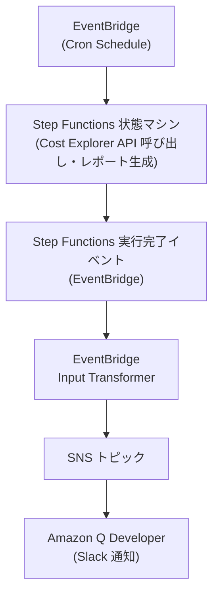

## はじめに

AWS の運用において、コスト管理は重要な課題です。従来、Slack などのチャットツールへの通知ソリューションとして、AWS Lambda を利用した定期的なコスト通知の仕組みに関する情報が多く公開されていました。しかし、Lambda を使った仕組みの場合、ランタイムバージョンの管理やパッチの適用など、長期運用時のメンテナンス負荷が増えるという課題があります。何とか AWS のマネージドサービスだけで Slack に通知できる仕組みを作れないかと考えていたところ、Step Functions を使用して AWS コストを処理する参考記事を見つけました。

そこから着想を得て、Lambda を使わずに AWS コスト情報を日次で Slack に通知する仕組みを、AWS のマネージドサービスのみで実装する方法を調査した結果をまとめます。具体的には、**Step Functions**、**EventBridge**、**SNS**、そして **Amazon Q Developer (旧 AWS Chatbot)** を活用した構成で作りました。

## 背景

- **Lambda 運用の課題**  
  長期運用時に Lambda のランタイムバージョンが古くなったり、パッチ適用が必要になったりすることは、運用負荷やセキュリティリスクの観点から避けられると嬉しい。

- **代替案のマネージドサービスの活用法の発見**  
  AWS コスト情報を取得する処理の部分は AWS Step Functions を、Slack への通知処理の部分は Amazon Q Developer を使うことで完全にマネージドなサービスに委譲する仕組みを構築可能と知りました。

- **コスト通知の重要性**  
  Slack などのチャットツールでコスト情報を把握できれば、コストの急激な上昇や異常な利用に迅速に対応することが可能となります。

## システム構成

今回の構成は以下の流れで実現します。

1. **定期実行 (EventBridge Cron) → Step Functions**  
   EventBridge の定期スケジュールにより、コスト情報を取得する Step Functions 状態マシンを起動します。

2. **Step Functions によるコスト取得と加工**

   - **Cost Explorer API の呼び出し**  
     Step Functions のタスク状態で `costexplorer:GetCostAndUsage` API を呼び出し、実行時の月初から当日までのコスト情報を取得します。
   - **データ抽出とレポート生成**  
     続く State で、API の結果を使って、コスト情報を通知するテキストデータにフォーマットします。

3. **Step Functions 実行結果の EventBridge 連携 → SNS 通知**  
   Step Functions の実行完了イベントを EventBridge がキャッチし、Input Transformer を使って通知用メッセージに変換します。そのメッセージを SNS トピックに送信します。

4. **SNS 通知の受信 → Amazon Q Developer (Slack)**  
   SNS トピックは Amazon Q Developer（旧 AWS Chatbot）に紐付けられており、Slack チャネルに通知が飛びます。

以下の図は全体のアーキテクチャを示しています。



## 実装の詳細

### Step Functions 状態マシン

状態マシンでは、まず `costexplorer:GetCostAndUsage` API を呼び出し、その出力から必要な情報（開始日、終了日、総コスト、通貨単位）を抽出します。以下は、状態マシンの定義例です。構築には Terraform を使いました。[sfn_state_machine](https://registry.terraform.io/providers/hashicorp/aws/latest/docs/resources/sfn_state_machine) のリソースの `definition` に以下の変数を定義として渡すことで、状態マシンを作成できます。

[GetCostAndUsage API](https://docs.aws.amazon.com/ja_jp/aws-cost-management/latest/APIReference/API_GetCostAndUsage.html)の仕様を参考に、`TimePeriod` などのパラメータを設定しています。`TimePeriod` の開始日と終了日は、実行時点のタイムスタンプから集計対象の月初から当日までの範囲を動的に生成するようにしています。[Step Functions の組み込み関数](https://docs.aws.amazon.com/ja_jp/step-functions/latest/dg/intrinsic-functions.html#asl-intrsc-func-string-operation)をいくつか使用しました。

```terraform
locals {
  state_machine_definition = <<EOF
{
  "Comment": "Generate cost report",
  "StartAt": "GetCostUsage",
  "States": {
    "GetCostUsage": {
      "Type": "Task",
      "Resource": "arn:aws:states:::aws-sdk:costexplorer:getCostAndUsage",
      "Parameters": {
        "TimePeriod": {
          "Start.$": "States.Format('{}-{}-01', States.ArrayGetItem(States.StringSplit($$.Execution.StartTime, '-'), 0), States.ArrayGetItem(States.StringSplit($$.Execution.StartTime, '-'), 1))",
          "End.$": "States.ArrayGetItem(States.StringSplit($$.Execution.StartTime, 'T'), 0)"
        },
        "Granularity": "MONTHLY",
        "Metrics": ["UnblendedCost"]
      },
      "Next": "ParseResult"
    },
    "ParseResult": {
      "Type": "Pass",
      "Parameters": {
        "startDate.$": "$.ResultsByTime[0].TimePeriod.Start",
        "endDate.$": "$.ResultsByTime[0].TimePeriod.End",
        "totalCost.$": "$.ResultsByTime[0].Total.UnblendedCost.Amount",
        "unit.$": "$.ResultsByTime[0].Total.UnblendedCost.Unit"
      },
      "Next": "CostReport"
    },
    "CostReport": {
      "Type": "Pass",
      "Parameters": {
        "report.$": "States.Format('{}{} ({} ~ {})', $.totalCost, $.unit, $.startDate, $.endDate)"
      },
      "End": true
    }
  }
}
EOF
}
```

### EventBridge ルールと Input Transformer

Step Functions の実行完了イベント（ステータス `SUCCEEDED`）をキャッチする EventBridge ルールを作成し、Input Transformer でメッセージを整形します。キャッチできる Step Functions の実行完了イベントは以下の形式を取ります。ここから、通知に使用したい AWS アカウント情報と、Step Functions から出力されたコスト情報を抽出します。

```json
{
  "version": "0",
  "id": "315c1398-40ff-a850-213b-158f73e60175",
  "detail-type": "Step Functions Execution Status Change",
  "source": "aws.states",
  "account": "123456789012",
  "time": "2019-02-26T19:42:21Z",
  "region": "us-east-1",
  "resources": [
    "arn:aws:states:us-east-1:123456789012:execution:state-machine-name:execution-name"
  ],
  "detail": {
    "executionArn": "arn:aws:states:us-east-1:123456789012:execution:state-machine-name:execution-name",
    "stateMachineArn": "arn:aws:states:us-east-1:123456789012:stateMachine:state-machine",
    "name": "execution-name",
    "status": "RUNNING",
    "startDate": 1551225271984,
    "stopDate": null,
    "input": "{}",
    "output": null
  }
}
```

以下は Input Transformer を使った EventBridge ルールを設定する Terraform リソースの例です。

```terraform
resource "aws_cloudwatch_event_target" "example" {
  rule      = <aws_cloudwatch_event_rule_name>
  target_id = <target_id>
  arn       = <sns_topic_arn_for_send_to_amazon_q_developer>

  input_transformer {
    input_paths = {
      accountId = "$.account",
      report    = "$.detail.output"
    }
    input_template = <<EOT
      {
        "version": "1.0",
        "source": "custom",
        "content": {
          "textType": "client-markdown",
          "title": "Cost Report for AccountID <accountId>",
          "description": <report>
        }
      }
EOT
  }
}
```

こう記述することで Amazon Q Developer からカスタムフォーマットでのメッセージを Slack に通知することが出来ます。

### Lambda を使わないメリットと注意点

やってみたまとめとして、以下のメリットと注意点が挙げられます。

- **メリット**

  - ランタイムの管理やバージョン更新が不要
  - 完全にマネージドなサービスで、運用負荷が低減される

- **注意点**
  - 状態マシンの定義が複雑になりがちで、Intrinsic Functions のデバッグに手間がかかる
  - ステート遷移ごとに課金されるため、頻繁な実行時にはコストに注意

ただ、Step Functions の実行回数は 1 日に 1 回であることを踏まえると、Lambda を使った実装と比べてコストが爆発的に増加することはないと考えられます。それと比べると、運用負荷の軽減につながる方が大きなメリットと言えるかなと思い、結果としてこの方法を採用しました。

## まとめ

他の Slack 通知の仕組みも Amazon Q Developer に寄せていきたいなと思いました。
この記事が、Lambda の運用負荷を避けつつコスト管理を実現したい方の参考になれば幸いです。
