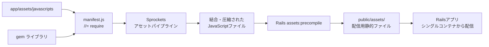
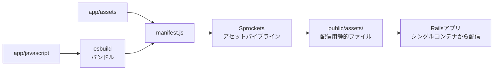

## はじめに

過去に作成した Rails プロダクトでは、従来の Sprockets によるアセットパイプラインで JavaScript を管理していました。今後の開発効率や保守性、モダンなフロントエンド技術への対応を考慮し、JS バンドリングの仕組み（node_modules の利用も含む）を取り入れる必要が出てきました。この記事は、その移行の中でハマったポイントを元に、手順や設定についてまとめたものです。

## なぜ esbuild なのか

JS バンドラーとしては、Webpack や Rollup、Parcel、そして最近注目の esbuild など複数の候補があります。最終的に esbuild を選んだ理由は以下の通りです。

- **圧倒的なビルド速度:**  
  Go 言語で実装された esbuild は、JavaScript ベースの他のバンドラーと比較して 10〜100 倍高速です。Webpack が数十秒かかるビルドが、esbuild では数百ミリ秒で完了し、開発中のホットリロードの体験が劇的に向上します。

- **最小限の設定で始められる:**  
  Webpack の複雑な設定ファイルや多数のローダー設定と比較して、esbuild はシンプルなコマンドや数行の設定で動作します。これにより、既存の Sprockets の仕組みに大きな変更を加えずに段階的に導入できました。

- **Rails プロジェクトとの親和性:**  
  jsbundling-rails との連携が簡単で、`app/assets/builds` にファイルを出力する設定が容易です。Rails の資産パイプラインの考え方とも合致し、移行がスムーズでした。

- **モダンなモジュールシステムのサポート:**  
  他のバンドラーと同様に ES Modules をサポートしていますが、Tree Shaking などの最適化が高速に行えます。

- **必要十分な機能セット:**  
  今回のプロジェクトでは、複雑な Code Splitting や特殊なトランスフォームが不要だったため、esbuild のシンプルな機能セットが適していました。Webpack のような豊富なエコシステムは必要ありませんでした。

## 移行前の構成とその課題

### 従来の Sprockets 構成

- **JavaScript ソース:**  
  `app/assets/javascripts` 配下に配置
- **manifest.js:**  
  `//= require` や `//= require_tree` によって、Sprockets が全ファイルを結合・圧縮
- **ライブラリ:**  
  gem 経由で提供され、Sprockets によって管理
- **配信:**  
  rails assets:precompile により生成された静的ファイルを、Rails アプリケーションが同梱するシングルコンテナから配信



### 課題

- **モダンな JavaScript 構文への対応:**  
  ES Modules や新しいライブラリ（node_modules 経由のもの）を活用しにくい
- **開発効率:**  
  変更検知やホットリロードが遅い
- **柔軟性の欠如:**  
  Sprockets は静的アセットの結合には適しているが、モジュール依存管理やコード分割などの最新技術には対応が難しい

## esbuild 導入後の最終構成

### ディレクトリ構成の変更

- **app/assets:**  
  Sprockets による CSS、画像、フォントなどの管理用
- **app/javascript:**  
  JavaScript のソースコードはここに移動
  - 例: `app/javascript/application.js` がエントリーポイント
- **app/assets/builds:**  
  esbuild によって生成されたバンドルファイルが出力されるディレクトリ  
  ※ ここに node_modules の依存関係を含めた結合・minify されたファイルが配置され、Rails の manifest ファイル（例: `app/assets/config/manifest.js`）でリンクされる

### 最終的な配信フロー

1. **開発:**  
   ソースコードは `app/javascript` 配下で管理。変更があるたびに esbuild の watch モードでバンドルが更新される。
2. **プリコンパイル:**  
   `rails assets:precompile` 時、Sprockets は manifest を参照し、必要なアセット（CSS、画像、そして esbuild で生成された JavaScript バンドル）を public 配下に配置。
3. **配信:**  
   Rails アプリケーションは、シングルコンテナ内にすべてのアセットを同梱して、ユーザーに配信。



## 導入手順

### esbuild のインストール

- `jsbundling-rails` gem を追加

```Gemfile
gem 'jsbundling-rails'
```

- `bin/rails javascript:install:esbuild` を実行し esbuild 等をインストール

```bash
bin/rails javascript:install:esbuild
```

### esbuild のセットアップ

`bin/rails javascript:install:esbuild` を実行すると、`package.json` に以下のようなスクリプトが追加されます。

```json
"scripts": {
  "build": "esbuild app/javascript/*.* --bundle --outdir=app/assets/builds",
}
```

`esbuild` は CLI だけでなく、Node.js でも実行できます。そのため、コマンドでオプションを指定するよりも柔軟性が高くなるかと考え、`esbuild.config.mjs` を作成し、以下のように設定しました。

```js
/**
 * esbuild.config.mjs
 * Rails + esbuild 連携のための設定ファイル
 *
 * このファイルは、app/javascript 配下のファイルを
 * app/assets/builds にバンドルするための設定です。
 */

import esbuild from "esbuild";
import * as glob from "glob";
import process from "process";

// コマンドライン引数からウォッチモードの有無を判定
const args = process.argv.slice(2);
const isWatchMode = args.includes("--watch");

// エントリーポイントの設定
// app/javascript 直下と、サブディレクトリ内のファイルをすべて対象にする
const entryPoints = [
  ...glob.sync("app/javascript/*.{js,ts,jsx,tsx}"), // 直下のJSファイル
  ...glob.sync("app/javascript/**/*.{js,ts,jsx,tsx}"), // サブディレクトリ内のJSファイル
];

// esbuildの設定オプション
const buildConfig = {
  entryPoints,
  bundle: true, // 依存関係も含めて1つのファイルにバンドル
  sourcemap: true, // デバッグ用にソースマップを生成
  format: "esm", // ECMAScript Modulesとして出力
  outdir: "app/assets/builds", // 出力先ディレクトリ（Railsのアセットパイプラインと連携）

  // 静的アセットのURL設定（本番環境ではCDNのURLに変更することも可能）
  publicPath: "/assets",

  // 各種ファイルタイプのローダー設定
  loader: {
    ".json": "json",
    // 必要に応じて追加: ".png": "file", ".svg": "file", など
  },

  // 出力ファイル名の設定
  assetNames: "[dir]/[name]",

  // エントリーポイントのベースディレクトリ
  outbase: "app/javascript",

  // ターゲットブラウザ/環境の設定
  target: ["es2020"], // ※本番環境に合わせて調整する

  // minify設定
  minify: process.env.NODE_ENV === "production", // 本番環境のみminify

  // コメント保持の設定
  legalComments: "inline",
};

// ビルド処理の実行
async function runBuild() {
  try {
    if (isWatchMode) {
      // 開発時のウォッチモード
      console.log("🔍 esbuild ウォッチモードを開始しました...");
      const context = await esbuild.context(buildConfig);
      await context.watch();
    } else {
      // 一度だけビルド（CI/CD や本番ビルド用）
      console.log("🚀 esbuildによるバンドルを開始します...");
      const result = await esbuild.build(buildConfig);
      console.log(
        `✅ ビルド完了! ${result.errors.length === 0 ? "成功" : "エラーあり"}`
      );
    }
  } catch (error) {
    console.error("❌ ビルドに失敗しました:", error);
    process.exit(1);
  }
}

runBuild();
```

上記の設定を踏まえて、以下のように `package.json` のスクリプトを更新しました。

```json
"scripts": {
  "build": "node esbuild.config.mjs",
  "build:watch": "node esbuild.config.mjs --watch"
}
```

### JavaScript ソースコードの移行

`app/assets/javascripts` 内の JavaScript コードを `app/javascript` に移動します。
この際、CommonJS スタイルの記法を ES Modules スタイルの記法に書き換えました。

### Sprockets の設定整理

manifest.js を更新し、不要な JS リンクディレクティブを削除して、esbuild で生成されたファイルをリンクするようにします。

```js
//= link_tree ../images
//= link_directory ../stylesheets .css
//= link application.css
//= link application.js
//= link_directory ../builds .js
```

## まとめ

今回の移行により、ビルド速度の向上、モジュール管理の容易さ、最新の最適化技術の活用が可能となり、今後の開発がより柔軟で効率的になりました。
