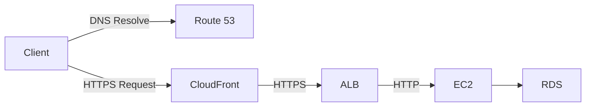
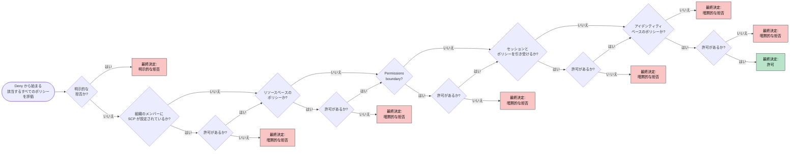

## この記事は

AWS 認定資格 SCS-C02 を受験した際に学んだことをまとめたものです。
単に AWS のセキュリティに関するサービスの知識を得ただけでなく、セキュリティの考え方や、AWS におけるセキュリティ対策についても学ぶことができました。
AWS を使うこと以外にも応用の効くセキュリティの考え方や、それを踏まえての AWS におけるセキュリティ対策を自分なりにまとめてみました。

> 対象読者
>
> - SCS‑C02 をこれから受験する方
> - AWS でセキュリティ設計・運用を担当するエンジニア／アーキテクト
> - クラウド以外でも応用できるセキュリティの考え方をキャッチアップしたい方

## AWS 認定資格について

[こちら](https://aws.amazon.com/jp/certification/)を参照。特に説明はしません。

## SCS-C02 とは

[こちら](https://aws.amazon.com/jp/certification/certified-security-specialty/)を参照。特に説明はしません。

## セキュリティの重要性と考え方

セキュリティは守る技術です。そのため、何を守るかを考えることが重要です。何を守るかが決まっていないと、姿の見えない的に対して無駄な対策を講じることになります。
そこで何を守るか・どう守るかを考えるためにも、まずは脅威モデルを作成することが重要になります。

脅威モデルとは、システムの脆弱性や攻撃者の行動を分析するためのフレームワークです。
脅威モデルを作成することで、攻撃者がどのような情報を盗むか/どのようにシステムに侵入するかを理解できます。
脅威モデルの作成手順として、以下のステップを踏むことが一般的です。

1. システムのエントリーポイントからストレージまでのデータフロー図を作成する
1. STRIDE のフレームワークを用いてシステムの脅威リストを作成する
1. 各脅威に対応する脆弱性とその緩和策を作成する
1. リスクを評価して適切な緩和策を選択する
1. 最終的に脅威が緩和されているかを確認する

STRIDE フレームワークとは、脅威を分類するための手法であり、以下の要素から成り立っています。

- Spoofing: なりすまし
- Tampering: 改ざん
- Repudiation: 否認
- Information Disclosure: 情報漏洩
- Denial of Service: サービス拒否
- Elevation of Privilege: 権限昇格

これらの要素が自分たちのシステムにどの様に引き起こされるかを考えることで、脅威を特定できます。

また、単に全ての脅威に対して対策を講じるのではなく、リスクを評価して適切な緩和策を選択することが重要です。
本当に必要なのは、以下の 3 要素が揃っている箇所が優先されると考えられます。

- 資産
- 脆弱性
- 脅威

個人情報や機密情報を含む様なデータや、システムの重要な部分の乗っ取りや改ざんなどは、特に注意が必要です。

また、ここまでは守ることに念頭を置いて書きましたが、守るだけがセキュリティではありません。

- 機密性: 情報が許可されたユーザーのみにアクセスできることを保証すること
- 完全性: 情報が正確であり、改ざんされていないことを保証すること
- 可用性: 情報が必要なときにアクセスできることを保証すること

これらはセキュリティの三大要素と呼ばれています。
機密性や完全性はもちろん重要ですが、可用性も重要です。
セキュリティでは、攻撃者がシステムに侵入した/攻撃を仕掛けた場合にも備えて、システムの稼働を維持しながら、情報を保護するための対策を講じることも重要です。
近年では、DDoS 攻撃やランサムウェアなどの攻撃が増加しており、可用性を確保することがますます重要になっています。

以上に述べたことを踏まえて、セキュリティを考えることが重要です。

## AWS におけるセキュリティ対策の考え方

AWS はクラウドサービスのため、セキュリティの考え方は部分的にオンプレミスと異なります。
例えば、AWS を使う場合、ユーザーは物理的なハードウェアを管理する必要がないため、盗難などの脅威は考慮する必要がありません。
また、マネージドサービスやサーバレスサービスを利用する場合は、OS やミドルウェアの詳細まで AWS が管理してくれるため、ユーザーはそれらのセキュリティを考慮する必要がありません。
セキュリティにも責任共有モデルが当てはまるということです。

これを踏まえて、ユーザーが AWS 上で構築するシステムの中でも、ユーザーが責任を持つ範囲のセキュリティは、ユーザーが対策を講じる必要があります。
ただし、AWS サービスとの連携が容易な便利なセキュリティに関する AWS サービスもあるため、これらを利用することで、セキュリティを強化できます。

一般的な Web アプリケーションを例にどんなセキュリティ対策が必要かを考えてみます。
例えば、Web アプリケーションを AWS 上で構築する場合、以下のようなシステム構成になることが多いです。

この場合、ユーザーに近いレイヤーから考えていくと、おおよそ以下のようなセキュリティ対策が考えられます。複数のサービスの組み合わせでセキュリティを強化することが基本になります。

1 つのプロダクトチームにおいては、こうしたセキュリティ対策で事足りることもあります。一方、CCoE やセキュリティチームの観点からセキュリティを考える場合、全てのプロダクトチームを横断してセキュリティを考える必要があります。こうした場合には、AWS Organization 等を活用したセキュリティ対策も考慮する必要があります。

| レイヤ / コンポーネント             | 目的                               | 主な AWS オプション                                                                                                              | 実装ポイント                                                          |
| ----------------------------------- | ---------------------------------- | -------------------------------------------------------------------------------------------------------------------------------- | --------------------------------------------------------------------- |
| **DNS (Route 53)**                  | フェイクゾーンやキャッシュ毒を防ぐ | • DNSSEC • Query Logging                                                                                                      | _ ゾーンを署名しドメイン移管を防止 _ ログは CloudWatch / S3 へ集中 |
| **Edge & DDoS**                     | 分散攻撃・Bot から守る             | • AWS Shield (Std/Adv) • CloudFront Regional Edge Cache                                                                       | \* Business SLA が要る場合 Shield Adv ＋ RTBH                         |
| **Layer‑7 Firewall**                | OWASP Top10・悪意 IP をブロック    | • AWS WAF (WebACL)                                                                                                               | _ マネージドルールで即時カバー _ Rate‑based + Geo/IP 属性ミックス  |
| **CDN/Content Policy (CloudFront)** | 通信暗号化・オリジン盗み見防止     | • ACM 証明書 • Origin Access Control (OAC) • Signed URL/Cookie                                                             | _ TLS 1.2+ ポリシー _ OAC で ALB 以外アクセス不可                  |
| **Load Balancer (ALB)**             | 暗号化終端・ゼロトラスト境界       | • TLS リスナー＋最新 Security Policy • ALB WAF (追加 WebACL)                                                                  | \* ALB SG を CloudFront IP だけに絞る                                 |
| **Network (VPC)**                   | 東西&北南トラフィック制御          | • Segmented Subnets • Security Groups • Network ACL / Network Firewall                                                     | _ EC2→RDS 以外を Deny _ Flow Logs を GuardDuty へ                  |
| **Compute (EC2)**                   | OS 強化・資格情報管理              | • IAM Role (最小権限) • SSM Patch / Inventory • Inspector • File System Encryption (EBS/KMS)                            | \* Passwordless; use Instance Connect or SSM セッション  Mgr          |
| **Data (RDS)**                      | 機密性・完全性・可用性             | • Encryption at Rest (KMS CMK) • SSL/TLS 接続必須 • IAM Database Auth • Automated & Cross‑Region Backups                | \* CMK をカスタムキーにして Key Policy を限定                         |
| **Secrets**                         | 認証情報の安全保管                 | • Secrets Manager / Parameter Store                                                                                              | \* Rotation Lambda で DB  パス定期更新                                |
| **Monitoring & Detection**          | 可視化／アラート                   | • CloudTrail (全リージョン＋組織集約) • CloudWatch Logs & Alarms • Config ルール • GuardDuty / Security Hub / Detective | \* EventBridge → SNS/ChatOps で即通知                                 |
| **Incident Response**               | 自動隔離・復旧                     | • EventBridge → Systems Manager Automation • バックアップ vault lock • Runbooks                                               | \* 例: GuardDuty Finding → SG に Quarantine list 適用                 |

また、AWS に限ったことではありませんが、システムを構築・運用する際は、複数のチームにまたがって活動する場合もあります。そのため、基本原則は多層防御を意識することです。同じ様なセキュリティ対策に見えても、複数の箇所で分けて設定することで、1 つの担当チームのミスがあったとしても、他のチームでカバーできるようにすることが重要です。

## 意識的に覚えたセキュリティに関するサービス

ここからは、AWS におけるセキュリティに関するサービスを紹介します。
自分が学習を進める中でも一見類似したサービスが多く存在する印象でしたが、それぞれのサービスの違いを理解することで、各セキュリティユースケースに適したサービスをより深く理解できました。

学習メモに残したサービスを、セキュリティの観点で分類して以下にまとめました。

## 1. Identity & Access

| 主役                                  | レイヤー                     | 典型用途                              | 違い／選定の軸                                                          |
| ------------------------------------- | ---------------------------- | ------------------------------------- | ----------------------------------------------------------------------- |
| **IAM** (ユーザー／ロール／ポリシー)  | AWS リソース操作             | ほぼすべての AWS 控えめに言って基盤   | _きめ細かい JSON ポリシーで最小権限_。人・サービス両方の ID を直接定義  |
| **STS**                               | 一時認証情報の発行           | クロスアカウント / 短命クレデンシャル | _AssumeRole_ で最大 12 h。`ExternalId` で SaaS 連携、MFA 併用で人の昇格 |
| **IAM Identity Center** (旧  SSO)     | 組織横断 IdP                 | 多アカウント運用の入口                | **SAML/OIDC** フェデレーション内蔵。権限セット＝実体は IAM ロール       |
| **Amazon Cognito**                    | アプリ／B2C 認証             | SPA・モバイル・ALB OIDC バックエンド  | ユーザープール & ID プール。ID プールは **STS の簡易ラッパー**          |
| **Verified Access** vs **Client VPN** | ゼロトラスト vs 従来 VPN     | Web アプリ (JWT) vs 任意 TCP          | Verified Access ＝デバイス＋ IdP 信頼。VPN はエージェント＋ TLS         |
| **Verified Permissions**              | 認可エンジン                 | ポリシー as data                      | Cedar 言語で RBAC/ABAC を API コール単位で動的判定                      |
| **Access Analyzer**                   | IAM/SCP/リソースポリシー解析 | 公開 or クロスアカウント穴あき検出    | 静的解析。SCP そのものの検証も可 (試験頻出)                             |

**押さえどころ**

_IAM = 発行源、STS = 一時キー、Identity Center = 組織入口、Cognito = アプリ入口、Verified Access/Permissions = ゼロトラスト強化。_

## 2. Secrets & Key Management

| 主役                                    | 管理主体             | 適するデータ                  | 差別化ポイント                                                      |
| --------------------------------------- | -------------------- | ----------------------------- | ------------------------------------------------------------------- |
| **KMS**                                 | 完全マネージド       | 暗号鍵 (CMK)                  | API ベース暗号化・自動ローテ・`kms:ViaService` 条件付きで権限最小化 |
| **CloudHSM**                            | お客様所有 (専有 HW) | FIPS 140‑2 Lv 3 必須キー、PKI | HSM クラスタ管理は自分。KMS CMK のキーストアとして組込み利用可      |
| **Secrets Manager**                     | マネージド           | DB パスワード、API キー       | 自動ローテ用 Lambda テンプレ、Rotation Window                       |
| **SSM Parameter Store** (Secure String) | マネージド           | 定数・設定値 + α              | コスト低い / 最大 64 KB / ローテなし。KMS Decrypt 権限が必須        |

**迷ったら** 
_“自動ローテ必要？ → Secrets Manager。FIPS レベル 3 が要件？ → CloudHSM。その他ほぼ全部  → KMS ＋ Parameter Store”。_

## 3. Network & Edge Protection

| レイヤ             | サービス                       | 役割                                    | 違いの本質                                                                     |
| ------------------ | ------------------------------ | --------------------------------------- | ------------------------------------------------------------------------------ |
| L3/L4 DDoS ⬆       | **Shield Standard / Advanced** | DDoS 吸収 + (Adv) 緊急連絡 / 保証       | _自動有効_（Std）。Adv は $$ + 保険＋ Route 53 / Global Accel まで保護         |
| L7 フィルタ        | **AWS WAF**                    | OWASP/Bot/Rate                          | ルールはパターンマッチ、ALB/API GW/CF に直接アタッチ                           |
| VPC 境界 FW        | **AWS Network Firewall**       | Stateful / Suricata IPS                 | **VPC 内**。East‑West も検査。45 Gbps / AZ ごと配置                            |
| ポリシー統制       | **Firewall Manager**           | WAF / SG / NF 設定を組織一括配布        | SCP 的 “セキュリティ装備の GuardRail”                                          |
| SG / NACL          | インスタンス / サブネット      | 最低限のステートフル / ステートレス ACL | “最後のローカル防壁”。試験では **SG = Stateful, NACL = Stateless** が定番 Word |
| VPC エンドポイント | **Gateway / Interface**        | VPC 内部からの AWS サービス接続         | _Gateway = S3/DynamoDB、Interface = その他_。VPC 内部から直接アクセス可        |

**選び分け** 
_外向き Web ⇒ WAF + Shield。VPC 内東西トラフィックも検査 ⇒ Network Firewall。複数アカウント横串 ⇒ Firewall Manager。_

### 4. 監視・検知・調査

| フェーズ         | サービス                                               | コア機能                             | 位置付け                                        |
| ---------------- | ------------------------------------------------------ | ------------------------------------ | ----------------------------------------------- |
| ログ取得         | **CloudTrail / VPC FlowLogs / Route 53 Resolver Logs** | API / ネット / DNS                   | 基本ログ三種の神器                              |
| ベースライン監査 | **AWS Config**                                         | 構成ドリフト検知                     | Drift → SSM Automation 修復まで自動化可         |
| ルール検知       | **Amazon GuardDuty**                                   | Flow/DNS/S3/EKS/RDS 異常             | _シグネチャ＋行動解析_。誤検知除外は “Suppress” |
| 脆弱性/露出      | **Amazon Inspector**                                   | EC2/ECR/CIS & “Network Reachability” | _資産 ×CVEs_ を継続スキャン                     |
| 深掘り調査       | **Amazon Detective**                                   | グラフ分析                           | GuardDuty 48 h 後に相関ビュー                   |
| 集約ビュー       | **AWS Security Hub**                                   | CIS/NIST 評点 & Findings             | GuardDuty/Inspector/Macie 等を一画面で          |
| 組織 Data Lake   | **AWS Security Lake**                                  | OCSF 形式ログを S3 集約              | Athena/Glue/SIEM 派生解析                       |

**覚え方**

_GuardDuty ＝「異常を鳴らす」→ Detective ＝「掘る」→ Security Hub ＝「一覧」→ Security Lake ＝「全部貯める」_。

### 5. パッチ・運用オートメーション

| サービス                                  | 何を自動化するか                    | 差別化                                                 |
| ----------------------------------------- | ----------------------------------- | ------------------------------------------------------ |
| **SSM Run Command / セッション  Manager** | 侵害 EC2/ECS にエージェント経由操作 | _SSH 不要・ログは CloudTrail_                          |
| **SSM Patch Manager**                     | OS パッチ適用 & コンプライアンス    | “パッチベースライン”＋ Maintenance Window              |
| **SSM Automation**                        | Playbook 実行                       | Config/SH Findings → 修復 Runbook                      |
| **ECS Exec**                              | コンテナ内コマンド                  | バックエンドは セッション  Manager (IAM + VPC EP 必須) |

### 6. データ保護

| 目的           | 選択肢                                       | ポイント                                                                                                |
| -------------- | -------------------------------------------- | ------------------------------------------------------------------------------------------------------- |
| S3 SSE         | **SSE‑S3 / SSE‑KMS / SSE‑C**                 | ガバナンス制約が使うべきではない言葉なので修正してください ⇒ SSE‑KMS ＋`aws:SecureTransport` などで強制 |
| WORM           | **S3 Object Lock** vs **Glacier Vault Lock** | S3 = バージョン単位 即適用可 / Glacier = Vault 単位 + 24 h commit                                       |
| TLS 証明書     | **ACM** vs 自己署名 (IAM/ELB import)         | ACM 自動更新。EC2 単体は自力で証明書設置                                                                |
| EBS/RDS 暗号化 | KMS CMK 必須 (RDS: 既存 → 复制から暗号化)    | CMK 選定と snapshot copy が定番試験ネタ                                                                 |

### 7. その他

| テーマ         | サービス                                          | ひとこと対比                           |
| -------------- | ------------------------------------------------- | -------------------------------------- |
| IMDSv2 強制    | **EC2**, SCP で `ec2:MetadataHttpTokens=required` | CloudWatch `MetadataNoToken` で監視    |
| イメージ署名   | **ECR Image Signing** vs 簡易タグ運用             | Sigstore/Notary V2                     |
| K8s ログ       | **EKS Control‑Plane Logging** vs CloudTrail       | デフォルト off、要個別 ON              |
| フォレンジック | **EC2Rescue**, セッション  Manager, Snapshot      | 隔離 SG → メモリダンプ → Copy‑on‑write |

## (補足)IAM ポリシーの適応ルール

試験対策として、対策用にこれだけは覚えておくと良いものとして、IAM ポリシーの適応ルールがあります。

IAM ポリシーは、AWS リソースへのアクセスを制御するための重要な要素です。ポリシーは JSON 形式で記述され、AWS リソースに対する許可や拒否のルールを定義します。こうしたポリシーを記載する箇所は、実は IAM ポリシーだけではなく、SCP やリソースベースポリシー、Permissions boundary など、さまざまな場所に存在します。これらが複合的に組み合わさる場合に、どの様にポリシーが適用されるかのルールを理解しておくと惑わされず問題を解けます。

最終的なアクセス可否は以下のルールに従って適用されます。

1. **Deny**: 明示的な拒否がある場合、アクセスは拒否されます。
2. **SCP**: 組織のメンバーに SCP が設定されている場合、SCP のポリシーが適用されます。SCP は組織全体に適用されるため、個々のアカウントやユーザーに対しても影響を与えます。
3. **リソースベースポリシー**: リソースベースのポリシーがある場合、リソースベースのポリシーが適用されます。リソースベースのポリシーは、特定の AWS リソースに対してアクセスを制御するために使用されます。
4. **Permissions boundary**: Permissions boundary が設定されている場合、Permissions boundary のポリシーが適用されます。Permissions boundary は、IAM ユーザーやロールに対して許可されるアクションの範囲を制限するために使用されます。
5. **セッションポリシー**: セッションポリシーが設定されている場合、セッションポリシーのポリシーが適用されます。セッションポリシーは、一時的な認証情報を使用して AWS リソースへのアクセス時に適用されるポリシーです。
6. **アイデンティティベースポリシー**: アイデンティティベースのポリシーがある場合、アイデンティティベースのポリシーが適用されます。アイデンティティベースのポリシーは、IAM ユーザーやロールに対してアクセスを制御するために使用されます。
7. **暗黙的な拒否**: 上記のいずれのポリシーにも該当しない場合、アクセスは暗黙的に拒否されます。
8. **許可**: 最後に、許可がある場合、アクセスが許可されます。

このルールを図にすると以下のようになります。

## まとめ

SCS-C02 の学習を通して、単にサービスの暗記をするだけでなく、実際のシナリオにおける適用方法やベストプラクティスを理解することが重要だと学びました。また、クラウドに留まらない汎用的な知識を身につけることができると感じました。もしこの記事を読んでいる方が SCS-C02 を受験する予定の方がいれば、ぜひ参考にしてみてください。
